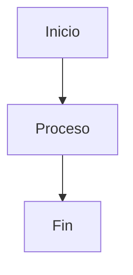

# [Título del Documento]

> _Esta es una plantilla general para todos los documentos del proyecto. Rellena cada sección con la información correspondiente y elimina las instrucciones en cursiva una vez completada. Mantén las mismas secciones para facilitar la revisión._

---

## 📑 Índice

1. [Metadatos del Documento](#1-metadatos-del-documento)
2. [Introducción](#2-introducción)
   - 2.1 [Objetivo](#21-objetivo)
   - 2.2 [Alcance](#22-alcance)
   - 2.3 [Contexto](#23-contexto)
3. [Glosario](#3-glosario)
4. [Contenido Principal](#4-contenido-principal)
   - 4.1 [Primera Sección de Contenido](#41-primera-sección-de-contenido)
   - 4.2 [Segunda Sección de Contenido](#42-segunda-sección-de-contenido)
   - 4.3 [Tercera Sección de Contenido](#43-tercera-sección-de-contenido)
5. [Diagramas y Recursos Visuales](#5-diagramas-y-recursos-visuales)
   - 5.1 [Nombre del Diagrama / Recurso](#51-nombre-del-diagrama--recurso)
6. [Análisis y Conclusiones](#6-análisis-y-conclusiones)
   - 6.1 [Principales Hallazgos](#61-principales-hallazgos)
   - 6.2 [Decisiones Tomadas](#62-decisiones-tomadas)
7. [Riesgos e Incertidumbres](#7-riesgos-e-incertidumbres)
8. [Referencias](#8-referencias)
9. [Historial de Cambios](#9-historial-de-cambios)

---

## 1. Metadatos del Documento

| Campo              | Valor                                      |
|--------------------|--------------------------------------------|
| **Nombre**         | [Nombre descriptivo del documento]         |
| **Tipo**           | [Análisis / Diseño / Investigación / Plan] |
| **Versión**        | 1.0                                        |
| **Fecha**          | YYYY-MM-DD                                 |
| **Autores**        | [Nombre(s) del equipo responsable]         |
| **Revisado por**   | [Nombre del revisor, si aplica]            |
| **Estado**         | [Borrador / En revisión / Aprobado]        |

---

## 2. Introducción

_Describe brevemente el propósito de este documento. ¿Qué se analiza, diseña o planifica aquí? ¿Por qué es relevante para el proyecto?_

### 2.1 Objetivo

_¿Qué se pretende conseguir con este documento?_

### 2.2 Alcance

_¿A qué parte del proyecto afecta? ¿Qué queda fuera del alcance de este documento?_

### 2.3 Contexto

_Describe brevemente el contexto del proyecto en el que se enmarca este documento._

---

## 3. Glosario

_Define aquí los términos técnicos, siglas o conceptos específicos que aparecen en el documento._

| Término       | Definición                                         |
|---------------|----------------------------------------------------|
| [Término 1]   | [Definición breve]                                 |
| [Término 2]   | [Definición breve]                                 |

---

## 4. Contenido Principal

_Esta es la sección principal del documento. Adapta las subsecciones según el tipo de documento:_

> 💡 **Guía según tipo de documento:**
> - **Análisis de competidores** → Tabla comparativa, fortalezas/debilidades, conclusiones.
> - **Análisis de requisitos** → Historias de usuario, casos de uso, reglas de negocio.
> - **Diseño del sistema** → Diagramas UML, decisiones arquitectónicas.
> - **Plan de proyecto** → Cronograma, recursos, riesgos.
> - **Investigación técnica** → Estado del arte, comparativa de tecnologías, conclusión.

### 4.1 [Primera Sección de Contenido]

_Ej: "Análisis de Competidores", "Requisitos Funcionales", "Decisiones de Diseño", etc._

### 4.2 [Segunda Sección de Contenido]

_Añade tantas subsecciones como sean necesarias._

### 4.3 [Tercera Sección de Contenido]

---

## 5. Diagramas y Recursos Visuales

_Incluye aquí todos los diagramas, tablas comparativas, mockups o imágenes relevantes._

### 5.1 [Nombre del Diagrama / Recurso]

_Describe brevemente qué representa el diagrama._

_O enlaza a un archivo externo:_

---

## 6. Análisis y Conclusiones

_Resume los hallazgos, decisiones tomadas o conclusiones obtenidas a partir del contenido del documento._

### 6.1 Principales Hallazgos

- [Hallazgo 1]
- [Hallazgo 2]
- [Hallazgo 3]

### 6.2 Decisiones Tomadas

_Si el documento implicó tomar decisiones (de diseño, tecnología, proceso, etc.), documéntalas aquí con su justificación._

| Decisión                    | Alternativas Consideradas        | Justificación                     |
|-----------------------------|----------------------------------|-----------------------------------|
| [Decisión tomada]           | [Opción A], [Opción B]           | [Motivo de la elección]           |

---

## 7. Riesgos e Incertidumbres

_Documenta los riesgos identificados relacionados con el contenido de este documento._

| Riesgo                     | Probabilidad     | Impacto          | Mitigación                        |
|----------------------------|------------------|------------------|-----------------------------------|
| [Descripción del riesgo]   | Alta/Media/Baja  | Alta/Media/Baja  | [Medida para reducir el riesgo]   |

---

## 8. Referencias

_Lista todas las fuentes, documentos o recursos consultados para elaborar este documento._

- [Nombre del recurso](URL) — _Breve descripción_
- [Otro documento del proyecto](../deliverables/NombreDocumento.md)
- [Enlace externo](https://ejemplo.com)

---

## 9. Historial de Cambios

_Registra aquí todas las modificaciones realizadas al documento._

| Versión | Fecha       | Autor(es)         | Descripción del cambio               |
|---------|-------------|-------------------|--------------------------------------|
| 1.0     | YYYY-MM-DD  | [Nombre]          | Creación inicial del documento       |
| 1.1     | YYYY-MM-DD  | [Nombre]          | [Descripción del cambio realizado]   |

---

> 📌 _Documento perteneciente al proyecto **CATLab** — DP1, Universidad de Sevilla._